Hotel demand analysis
================

# Hotel Demand Data Analysis Project

# 

# Introduction

The dataset used in the project is taken from
[Kaggle](https://www.kaggle.com/datasets/jessemostipak/hotel-booking-demand).The
dataset contains booking information for a city hotel and a resort
hotel, and includes information such as when the booking was made,
length of stay, the number of adults, children, and/or babies, and the
number of available parking spaces, among other things.

In this project, I am following the data analysis process having these
phases listed below:

1.  Ask
2.  Prepare
3.  Process
4.  Analyse
5.  Share
6.  Act

# Business Scenario

Hotel company Bloomingbell has opened two new properties in Portugal,
one them is a resort hotel & the other one is a city hotel in the
metropolitan area. The General Manager Mr. Joao Cabral & the Director of
Marketing & Business Strategy Ms. Jenna Aurora want the team of data
analysts to analyse the past data of a hotel property in the region &
derive some insights that could be used to help maximize the profit
during the upcoming business period.

# Methodology & Process

## Ask

The main focus of this project is exploratory data analysis. In the ask
phase, I have brainstormed a few questions which can be answered using
this dataset. The answers of these questions then can be formulated to
find insights that can be shared with the marketing & strategy
management team of the hotel management to help them make better
decisions for achieving a profitable business in the upcoming business
period.

The questions are as follows:

1.  How many bookings were done in different types of hotels ? Which
    hotel type has maximum percentage of bookings ?

2.  Maximum number of bookings were made by guests of which countries ?

3.  What are total bookings in each hotel (year-wise) ?

4.  What are the different customer types who booked these hotels ?

5.  What are the total number of bookings made by guests with or without
    children in two different types of hotel ?

6.  Which month observed highest bookings by family people ? Which one
    observed bookings by people with no children ? in each of the two
    hotels

7.  Which booking agent has highest number of bookings in both the hotel
    ?

8.  How many bookings were cancelled out of total bookings ?

9.  Which period of stay observed the maximum ADR ?

10. What are the different types of meals booked by bookings that did
    not get cancelled ?

## Prepare

For this project the data is taken from Kaggle. It contains booking
information of different customers in two types of hotel, one of them is
a city hotel & other one is a resort hotel. The customer Id have been
removed to preserve the data privacy. It contains 32 variables including
features of the dataset which is basically the information like month &
year of arrival, type of guests, type of booking, type of meals etc.
This dataset format is in wide data format. Throughout the process, I am
considering only those bookings that were not cancelled(Successful
bookings) as they are the only ones who provided business to the hotel
in real sense.

## Process

I am using R for this project due the code reproducibility feature of a
programming language. Also this dataset is large R can handle it fast &
in a better way. The data seems to be consistent and with zero errors.I
proceed with the first steps of data pre-processing and henceforth
processing.

### Importing Essential Libraries

Since I need to load multiple libraries I will use pacman package to
fasten up this process instead of loading them one by one

``` r
# install.packages("pacman")

pacman::p_load("readr","tidyverse", "janitor", "dplyr", "skimr", "ggplot2", "tictoc")
```

### Data importation

I will import the data as per the source file. The source file is in csv
format.

``` r
# Reading & assigning the data in the file to a data frame object

hotel <- read.csv('./data/hotel_bookings.csv', stringsAsFactors = TRUE)
```

### Data Viewing

Since I am focusing on data analysis in this project, I don’t want all
the columns so I will drop the ones not needed

``` r
# Viewing variables of the dataset 

colnames(hotel)
```

    ##  [1] "hotel"                          "is_canceled"                   
    ##  [3] "lead_time"                      "arrival_date_year"             
    ##  [5] "arrival_date_month"             "arrival_date_week_number"      
    ##  [7] "arrival_date_day_of_month"      "stays_in_weekend_nights"       
    ##  [9] "stays_in_week_nights"           "adults"                        
    ## [11] "children"                       "babies"                        
    ## [13] "meal"                           "country"                       
    ## [15] "market_segment"                 "distribution_channel"          
    ## [17] "is_repeated_guest"              "previous_cancellations"        
    ## [19] "previous_bookings_not_canceled" "reserved_room_type"            
    ## [21] "assigned_room_type"             "booking_changes"               
    ## [23] "deposit_type"                   "agent"                         
    ## [25] "company"                        "days_in_waiting_list"          
    ## [27] "customer_type"                  "adr"                           
    ## [29] "required_car_parking_spaces"    "total_of_special_requests"     
    ## [31] "reservation_status"             "reservation_status_date"

``` r
# Selecting the required variables

hotel_copy <- hotel %>% select(c(1,2,4:18,20,24,26:28,30))
```

Let’s see first 10 rows using tibble

``` r
tibble(hotel_copy)
```

    ## # A tibble: 119,390 × 23
    ##    hotel        is_canceled arrival_date_year arrival_date_mon… arrival_date_we…
    ##    <fct>              <int>             <int> <fct>                        <int>
    ##  1 Resort Hotel           0              2015 July                            27
    ##  2 Resort Hotel           0              2015 July                            27
    ##  3 Resort Hotel           0              2015 July                            27
    ##  4 Resort Hotel           0              2015 July                            27
    ##  5 Resort Hotel           0              2015 July                            27
    ##  6 Resort Hotel           0              2015 July                            27
    ##  7 Resort Hotel           0              2015 July                            27
    ##  8 Resort Hotel           0              2015 July                            27
    ##  9 Resort Hotel           1              2015 July                            27
    ## 10 Resort Hotel           1              2015 July                            27
    ## # … with 119,380 more rows, and 18 more variables:
    ## #   arrival_date_day_of_month <int>, stays_in_weekend_nights <int>,
    ## #   stays_in_week_nights <int>, adults <int>, children <int>, babies <int>,
    ## #   meal <fct>, country <fct>, market_segment <fct>,
    ## #   distribution_channel <fct>, is_repeated_guest <int>,
    ## #   previous_cancellations <int>, reserved_room_type <fct>, agent <fct>,
    ## #   days_in_waiting_list <int>, customer_type <fct>, adr <dbl>, …

Some values in some columns turned out to be “NULL” strings and the
(source
document)\[<https://www.sciencedirect.com/science/article/pii/S2352340918315191?via%3Dihub>\]
clarifies that they are not missing values but not applicable citing
example that if a booking “Agent” is defined as “NULL” it means that the
booking did not came from a travel agent. Nevertheless, I will convert
them into NA to avoid any confusion when doing EDA.

``` r
# Converting NULL values to NA using vectorization

hotel_copy[hotel_copy=="NULL"] <- NA
```

Let’s check the data types of all the variables

``` r
# Viewing the structure of the dataset

str(hotel_copy)
```

    ## 'data.frame':    119390 obs. of  23 variables:
    ##  $ hotel                    : Factor w/ 2 levels "City Hotel","Resort Hotel": 2 2 2 2 2 2 2 2 2 2 ...
    ##  $ is_canceled              : int  0 0 0 0 0 0 0 0 1 1 ...
    ##  $ arrival_date_year        : int  2015 2015 2015 2015 2015 2015 2015 2015 2015 2015 ...
    ##  $ arrival_date_month       : Factor w/ 12 levels "April","August",..: 6 6 6 6 6 6 6 6 6 6 ...
    ##  $ arrival_date_week_number : int  27 27 27 27 27 27 27 27 27 27 ...
    ##  $ arrival_date_day_of_month: int  1 1 1 1 1 1 1 1 1 1 ...
    ##  $ stays_in_weekend_nights  : int  0 0 0 0 0 0 0 0 0 0 ...
    ##  $ stays_in_week_nights     : int  0 0 1 1 2 2 2 2 3 3 ...
    ##  $ adults                   : int  2 2 1 1 2 2 2 2 2 2 ...
    ##  $ children                 : int  0 0 0 0 0 0 0 0 0 0 ...
    ##  $ babies                   : int  0 0 0 0 0 0 0 0 0 0 ...
    ##  $ meal                     : Factor w/ 5 levels "BB","FB","HB",..: 1 1 1 1 1 1 1 2 1 3 ...
    ##  $ country                  : Factor w/ 178 levels "ABW","AGO","AIA",..: 137 137 60 60 60 60 137 137 137 137 ...
    ##  $ market_segment           : Factor w/ 8 levels "Aviation","Complementary",..: 4 4 4 3 7 7 4 4 7 6 ...
    ##  $ distribution_channel     : Factor w/ 5 levels "Corporate","Direct",..: 2 2 2 1 4 4 2 2 4 4 ...
    ##  $ is_repeated_guest        : int  0 0 0 0 0 0 0 0 0 0 ...
    ##  $ previous_cancellations   : int  0 0 0 0 0 0 0 0 0 0 ...
    ##  $ reserved_room_type       : Factor w/ 10 levels "A","B","C","D",..: 3 3 1 1 1 1 3 3 1 4 ...
    ##  $ agent                    : Factor w/ 334 levels "1","10","103",..: NA NA NA 157 103 103 NA 156 103 40 ...
    ##  $ days_in_waiting_list     : int  0 0 0 0 0 0 0 0 0 0 ...
    ##  $ customer_type            : Factor w/ 4 levels "Contract","Group",..: 3 3 3 3 3 3 3 3 3 3 ...
    ##  $ adr                      : num  0 0 75 75 98 ...
    ##  $ total_of_special_requests: int  0 0 0 0 1 1 0 1 1 0 ...

In this dataset is_cancelled, is_repeated & arrival_date_year are also
categorical variables. I will coerce them into categorical variables
using factor function.

``` r
hotel_copy$is_canceled <- as.factor(hotel_copy$is_canceled)
hotel_copy$is_repeated_guest <- as.factor(hotel_copy$is_repeated_guest)
hotel_copy$arrival_date_year <- as.factor(hotel_copy$arrival_date_year)
```

Before moving forward for exploratory data analysis and visualization, I
will perform two more operations: 1. Remove empty rows & columns, 2.
count NA values before any further analysis.

``` r
# Removing empty rows & columns
hotel <- hotel %>% remove_empty(c("rows", "cols"))
```

``` r
# Using colSums function to see NA values column-wise.

colSums(is.na(hotel_copy))
```

    ##                     hotel               is_canceled         arrival_date_year 
    ##                         0                         0                         0 
    ##        arrival_date_month  arrival_date_week_number arrival_date_day_of_month 
    ##                         0                         0                         0 
    ##   stays_in_weekend_nights      stays_in_week_nights                    adults 
    ##                         0                         0                         0 
    ##                  children                    babies                      meal 
    ##                         4                         0                         0 
    ##                   country            market_segment      distribution_channel 
    ##                       488                         0                         0 
    ##         is_repeated_guest    previous_cancellations        reserved_room_type 
    ##                         0                         0                         0 
    ##                     agent      days_in_waiting_list             customer_type 
    ##                     16340                         0                         0 
    ##                       adr total_of_special_requests 
    ##                         0                         0

## Analyze

**Viewing the summary statistics**

Let’s look at some basic statistics.

``` r
skim_without_charts(hotel_copy)
```

|                                                  |            |
|:-------------------------------------------------|:-----------|
| Name                                             | hotel_copy |
| Number of rows                                   | 119390     |
| Number of columns                                | 23         |
| \_\_\_\_\_\_\_\_\_\_\_\_\_\_\_\_\_\_\_\_\_\_\_   |            |
| Column type frequency:                           |            |
| factor                                           | 12         |
| numeric                                          | 11         |
| \_\_\_\_\_\_\_\_\_\_\_\_\_\_\_\_\_\_\_\_\_\_\_\_ |            |
| Group variables                                  | None       |

Data summary

**Variable type: factor**

| skim_variable        | n_missing | complete_rate | ordered | n_unique | top_counts                                     |
|:---------------------|----------:|--------------:|:--------|---------:|:-----------------------------------------------|
| hotel                |         0 |          1.00 | FALSE   |        2 | Cit: 79330, Res: 40060                         |
| is_canceled          |         0 |          1.00 | FALSE   |        2 | 0: 75166, 1: 44224                             |
| arrival_date_year    |         0 |          1.00 | FALSE   |        3 | 201: 56707, 201: 40687, 201: 21996             |
| arrival_date_month   |         0 |          1.00 | FALSE   |       12 | Aug: 13877, Jul: 12661, May: 11791, Oct: 11160 |
| meal                 |         0 |          1.00 | FALSE   |        5 | BB: 92310, HB: 14463, SC: 10650, Und: 1169     |
| country              |       488 |          1.00 | FALSE   |      177 | PRT: 48590, GBR: 12129, FRA: 10415, ESP: 8568  |
| market_segment       |         0 |          1.00 | FALSE   |        8 | Onl: 56477, Off: 24219, Gro: 19811, Dir: 12606 |
| distribution_channel |         0 |          1.00 | FALSE   |        5 | TA/: 97870, Dir: 14645, Cor: 6677, GDS: 193    |
| is_repeated_guest    |         0 |          1.00 | FALSE   |        2 | 0: 115580, 1: 3810                             |
| reserved_room_type   |         0 |          1.00 | FALSE   |       10 | A: 85994, D: 19201, E: 6535, F: 2897           |
| agent                |     16340 |          0.86 | FALSE   |      333 | 9: 31961, 240: 13922, 1: 7191, 14: 3640        |
| customer_type        |         0 |          1.00 | FALSE   |        4 | Tra: 89613, Tra: 25124, Con: 4076, Gro: 577    |

**Variable type: numeric**

| skim_variable             | n_missing | complete_rate |   mean |    sd |    p0 |   p25 |   p50 | p75 | p100 |
|:--------------------------|----------:|--------------:|-------:|------:|------:|------:|------:|----:|-----:|
| arrival_date_week_number  |         0 |             1 |  27.17 | 13.61 |  1.00 | 16.00 | 28.00 |  38 |   53 |
| arrival_date_day_of_month |         0 |             1 |  15.80 |  8.78 |  1.00 |  8.00 | 16.00 |  23 |   31 |
| stays_in_weekend_nights   |         0 |             1 |   0.93 |  1.00 |  0.00 |  0.00 |  1.00 |   2 |   19 |
| stays_in_week_nights      |         0 |             1 |   2.50 |  1.91 |  0.00 |  1.00 |  2.00 |   3 |   50 |
| adults                    |         0 |             1 |   1.86 |  0.58 |  0.00 |  2.00 |  2.00 |   2 |   55 |
| children                  |         4 |             1 |   0.10 |  0.40 |  0.00 |  0.00 |  0.00 |   0 |   10 |
| babies                    |         0 |             1 |   0.01 |  0.10 |  0.00 |  0.00 |  0.00 |   0 |   10 |
| previous_cancellations    |         0 |             1 |   0.09 |  0.84 |  0.00 |  0.00 |  0.00 |   0 |   26 |
| days_in_waiting_list      |         0 |             1 |   2.32 | 17.59 |  0.00 |  0.00 |  0.00 |   0 |  391 |
| adr                       |         0 |             1 | 101.83 | 50.54 | -6.38 | 69.29 | 94.58 | 126 | 5400 |
| total_of_special_requests |         0 |             1 |   0.57 |  0.79 |  0.00 |  0.00 |  0.00 |   1 |    5 |

Findings

From the above summary:

-   The dataset contains maximum bookings from City Hotel.
-   The dataset contains maximum bookings made through Travel Agency.
-   3810 bookings were made by repeat guests out of total bookings.
-   Average days in waiting list in the combined bookings of both the
    hotels turns out to be 2 days.

### Market Analysis

1.  How many bookings were done in different types of hotels ? Which
    hotel type got maximum percentage of bookings ?

``` r
# Plotting a bar chart to see which hotel had most bookings

plot_type_hotel <- hotel_copy %>% select(hotel, is_canceled) %>%  filter(is_canceled == 0) %>% 
  group_by(hotel) %>% summarise(count =n()) %>% mutate(percent = (count/sum(count))*100) %>% 
  ggplot()+
  geom_bar(aes(x = hotel, y =percent, fill = hotel),stat = 'identity', width = 0.50)+
  labs(x= "Type of hotel",y= "Booking(in percentages)" , caption= "The plot shows percentage of succesful bookings in the two hotels")+
  theme(plot.caption = element_text(hjust = 0.5))

plot_type_hotel
```

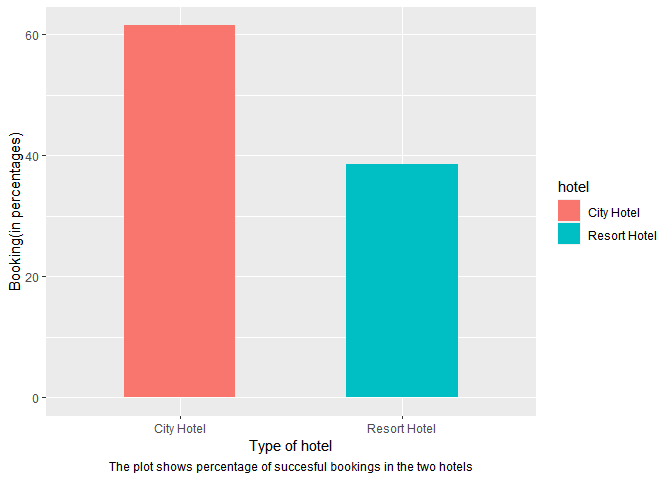<!-- -->

**Findings**

More than 60% of total bookings were made in the city hotel than resort
hotel. As per the source paper these records were of the period 1st of
July of 2015 and the 31st of August 2017.

2.  Maximum number of bookings were made by guests of which countries ?

``` r
# Checking number of countries in the dataset
n_unique(hotel_copy$country)
```

    ## [1] 177

``` r
#creating a second copy for finding unique country values of successful(not cancelled) bookings

hotel_copy_2 <- hotel_copy %>% select(hotel, country) %>%  filter(hotel_copy$is_canceled==0)

n_unique(hotel_copy_2)
```

    ## [1] 167

I will work on this second copy to proceed further for this part of
analysis

``` r
#creating a cross tabulation of two data frames to get the frequency. 

table_1 <- hotel_copy_2 %>% tabyl(country,hotel) %>% clean_names
head(table_1,3)
```

    ##  country city_hotel resort_hotel
    ##      ABW          2            0
    ##      AGO        140           17
    ##      AIA          1            0

``` r
# Getting the top 50 rows of frequency table with total bookings more than 1000

freq_table_city <- table_1 %>% select(country,city_hotel) %>% filter(!is.na(country)) %>%  arrange(desc(city_hotel))

freq_table_resort <- table_1 %>% select(country,resort_hotel) %>% filter(!is.na(country))%>% arrange(desc(resort_hotel))
```

``` r
# creating a lollipop chart for city hotel to see maximum bookings in city hotel

plot_country_city <- freq_table_city %>% 
  filter(city_hotel > 500) %>% 
  ggplot(aes(x=reorder(country, city_hotel), y= city_hotel))+
  geom_segment(aes(x= reorder(country, city_hotel), xend= country, y= 0,  yend= city_hotel), linetype="solid", size=1)+
  geom_point(shape=21, fill="skyblue", size=6)+
  coord_flip()+
  scale_y_continuous(breaks = seq(0, 11000, by= 1000))+
  labs(x= "Country" ,y="Total bookings in City Hotel" )

plot_country_city
```

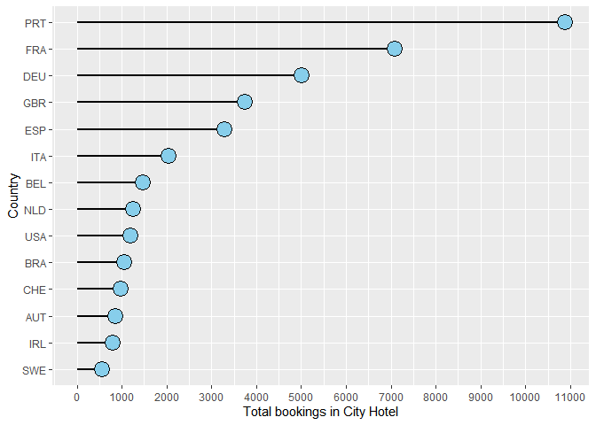<!-- -->

``` r
# creating a lollipop chart for resort hotel to see maximum bookings in resort hotel

plot_country_resort <- freq_table_resort %>% 
  filter(resort_hotel>500) %>% 
  ggplot(aes(x= reorder(country, resort_hotel) , y= resort_hotel))+
  geom_segment(aes(x= reorder(country, resort_hotel), xend= country, y=0, yend= resort_hotel), linetype= "solid", size= 1)+
  geom_point(size=6, shape = 21, fill="lightpink")+
  coord_flip()+
  scale_y_continuous(breaks=seq(0, 11000, by=1000))+
  labs(x= "Country" ,y="Total bookings in Resort Hotel")

plot_country_resort
```

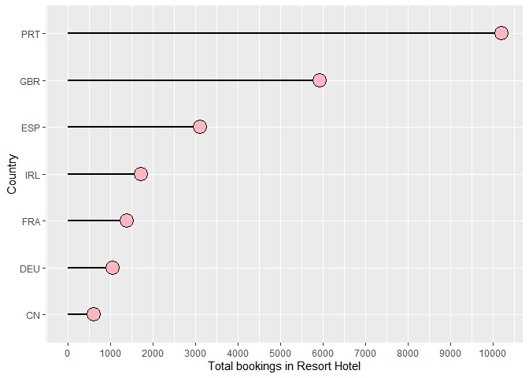<!-- -->

**Findings**

Top 5 countries with maximum number of bookings in:

-   city hotel came from Portugal, France, Germany, UK, Spain, Italy,
    Belgium, Netherlands, US & Brazil,
-   resort hotel came from Portugal, UK, Spain, Ireland, France &
    Germany.

3.  Which booking source brought most =number of bookings in each hotel
    and how other booking segments contribute in overall bookings ?

``` r
plot_market_segment <- hotel_copy %>% 
  select(hotel, market_segment) %>% 
  ggplot()+
  geom_bar(aes(x=market_segment, fill=hotel), position = "Dodge")+
  scale_y_continuous(breaks = seq(0,40000, by=2500))+
  labs(x="Type of booking market segment" , y= "Number of bookings made", caption = "The bar plot shows total bookings by each segment in the two hotels")+
  theme(axis.text.x = element_text(angle = 45), plot.caption = element_text(hjust = 0.5))

plot_market_segment
```

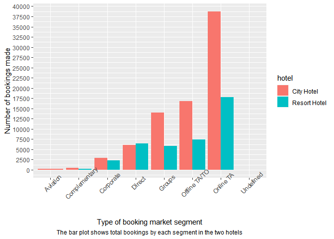<!-- -->

Verifying that the resort hotel doesn’t have a single booking from
Aviation because it’s not clear from the chart.

``` r
# Verifying that the resort hotel doesn't have a single booking from Aviation because it's not clearly visible in the chart
hotel_copy %>% 
  filter(hotel=="Resort Hotel", market_segment == "Aviation")
```

    ##  [1] hotel                     is_canceled              
    ##  [3] arrival_date_year         arrival_date_month       
    ##  [5] arrival_date_week_number  arrival_date_day_of_month
    ##  [7] stays_in_weekend_nights   stays_in_week_nights     
    ##  [9] adults                    children                 
    ## [11] babies                    meal                     
    ## [13] country                   market_segment           
    ## [15] distribution_channel      is_repeated_guest        
    ## [17] previous_cancellations    reserved_room_type       
    ## [19] agent                     days_in_waiting_list     
    ## [21] customer_type             adr                      
    ## [23] total_of_special_requests
    ## <0 rows> (or 0-length row.names)

**Findings**

From the above plot:

-   Both City & Resort hotels have maximum bookings incoming from Online
    Travel Agencies.

-   Both resort & city hotels had less than 1250 Bookings as
    complimentary bookings.

-   Corporate bookings made in both the hotels seem to be having very
    less difference but City hotels were more preferred by Corporate
    segments probably due to vicinity to the main city.

-   Direct bookings were severely lower than bookings that came from
    travel agencies for both the hotels. This might be because agencies
    are selling rooms at higher discounts than normal hotel price.

4.  Totals bookings in each hotel year-wise

``` r
hotel_copy %>%  select(hotel, is_canceled, arrival_date_year) %>% 
  filter(is_canceled == 0) %>% 
  tabyl(hotel, arrival_date_year)
```

    ##         hotel 2015  2016  2017
    ##    City Hotel 7678 22733 15817
    ##  Resort Hotel 6176 13637  9125

This frequency table shows year wise booking distribution. The booking
started from 1st of July of 2015 and the 31st of August 2017.
Considering year 2016 here, it’s clear from above that the City hotel
had more number of bookings than the resort hotel.

### Guest Types Analysis

Digging deep into the data to find out the booking behavior of guests in
two different categories.

1.  Different customer types who booked these hotels.

``` r
# Finding the different customer types

levels(hotel_copy$customer_type)
```

    ## [1] "Contract"        "Group"           "Transient"       "Transient-Party"

So, there are 4 unique customer types. Now I will plot a bar chart to
show them them according to hotel type.

``` r
# Plotting a bar chart 
plot_type_customer <- hotel_copy %>%  
  filter(is_canceled == 0, !is.na(customer_type)) %>%
  group_by(customer_type, hotel) %>% 
  summarise(count =n()) %>% 
  ggplot()+ 
  geom_bar(aes( x= customer_type, y=count, fill= hotel), stat = 'identity', position = 'dodge')+
  scale_y_continuous(breaks = seq(0, 40000, by= 2500)) +
  labs(x= 'Type of Customers', y= 'Total Bookings', caption = "Plot shows total succesful bookings in two types of hotel by different type of customers")+ 
  theme(plot.caption = element_text(hjust = 0.5))

plot_type_customer
```

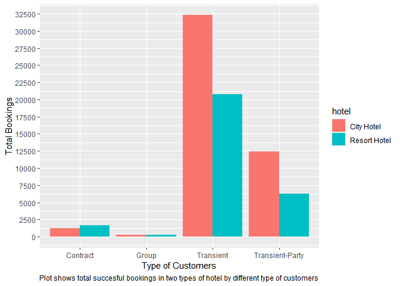<!-- -->

**Findings**

As we can see, maximum bookings were made by Transient types of guests
in City hotel & Resort Hotels. The number of bookings by groups were low
in both the city hotel as well as the resort hotel.

2.  What are the total number of bookings made by guests with or without
    children in two different types of hotel ?

First I will have to make a separate column for guests with and without
children

``` r
# making separate column for labeling data according to number of children

hotel_copy <- hotel_copy %>% mutate(guest_type = case_when(
  children == 0 ~ "guest_no_child",
  children > 0 ~ "guest_with_child"
))
```

``` r
# creating a grouped bar plot to show different variables 

plot_type_guests <-  hotel_copy %>% 
  filter(hotel_copy$is_canceled == 0) %>%
  group_by(hotel, guest_type) %>% 
  summarise(count = n()) %>% 
  ggplot() +
  geom_bar(aes(x= guest_type, y= count, fill= hotel), stat='identity', position = 'dodge') +
  scale_y_continuous(breaks = seq(0, 50000, by=2500))+
  labs(x= "Total Bookings",y= "Type Of Guests", caption = "No. of bookings made by guests with & without children in two types of hotels")+
  theme(plot.caption = element_text(hjust = 0.5))

plot_type_guests
```

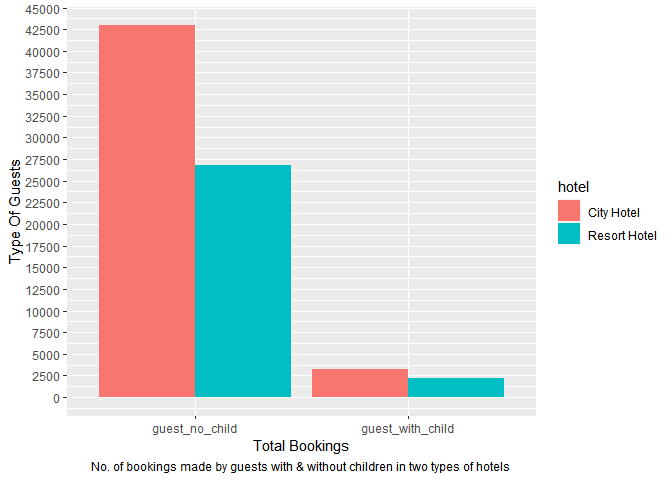<!-- -->

**Findings**

-   In each of the two types of hotel, total Bookings made by guests
    with no child was more than guests with one or more child
    accompanying them.

3.  Which month observed highest bookings by family people ? Which
    observed bookings by people with no children ?

I have assumed here that people accompanying 1 or more child are family
people and without no child are non-family. Here, I have taken data from
year of arrivals in 2016 instead of 2017 to look at monthly pattern of
bookings in each type of hotel across an year.

``` r
# Creating a frequency table for City hotel bookings in 2016

table_city_2016 <-  hotel_copy %>% filter(is_canceled==0 & hotel== "City Hotel" & arrival_date_year == "2016") %>% 
  tabyl(arrival_date_month, guest_type)
head(table_city_2016, 3)
```

    ##  arrival_date_month guest_no_child guest_with_child
    ##               April           1874              148
    ##              August           1779              352
    ##            December           1261              145

``` r
# Plotting line graph

plot_guests_city_2016 <- table_city_2016 %>%
  ggplot()+
  geom_line(aes(x= arrival_date_month, y= guest_no_child, color= 'guest_no_child', group=1), size = 1)+
  geom_point(aes(x= arrival_date_month, y= guest_no_child, color= 'guest_no_child', group=1))+
  geom_line(aes(x= arrival_date_month, y= guest_with_child, color= 'guest_with_child', group=1),size = 1)+
  geom_point(aes(x= arrival_date_month, y= guest_with_child, color= 'guest_with_child', group=1))+
  scale_x_discrete(limits=month.name)+
  labs(x= "Months",y= "Total Bookings in City Hotel" , caption= "Shows booking across 2016 in City Hotel by guests with 1 or more child & with no child.")+
  theme(axis.text.x = element_text(angle = 45), plot.caption = element_text(hjust = 0.5) )+
  scale_y_continuous(breaks = seq(0,2250, by= 250))

plot_guests_city_2016
```

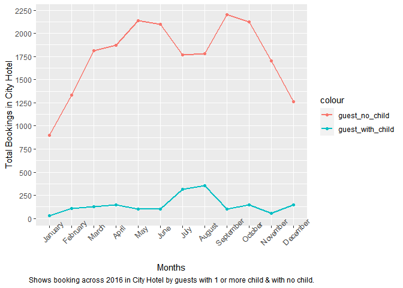<!-- -->

**Findings**

-   During 2016, guests with no accompanying child made the highest
    number of bookings for arrivals in April to May & it went down after
    June. It again reached highs during August to September and went
    down after September. Those months seem to be a good time to sell
    room at competitive rates.

-   During the same year, guests with 1 or more child which includes
    babies as well in certain cases & assuming most bookings tend to be
    family outings,the marketing team can come out with competitive
    packages during June to August. That duration witnessed highest
    bookings.

Now, let’s see the pattern in resort type hotel during 2016.

``` r
#creating a frequency table for Resort hotel bookings in 2016

table_resort_2016 <-  hotel_copy %>% filter(is_canceled==0 & hotel== "Resort Hotel" & arrival_date_year == "2016") %>% 
  tabyl(arrival_date_month, guest_type)
head(table_city_2016, 3)
```

    ##  arrival_date_month guest_no_child guest_with_child
    ##               April           1874              148
    ##              August           1779              352
    ##            December           1261              145

``` r
#Creating the plot object 

plot_guests_resort_2016 <- table_resort_2016 %>%
  ggplot()+
  geom_line(aes(x= arrival_date_month, y= guest_no_child, color= 'guest_no_child', group=1), size = 1)+
  geom_point(aes(x= arrival_date_month, y= guest_no_child, color= 'guest_no_child', group=1))+
  geom_line(aes(x= arrival_date_month, y= guest_with_child, color= 'guest_with_child', group=1),size = 1)+
  geom_point(aes(x= arrival_date_month, y= guest_with_child, color= 'guest_with_child', group=1))+
  scale_x_discrete(limits=month.name)+
  labs(x= "Months",y= "Total Bookings in Resort Hotel" , caption= "Shows booking across 2016 in Resort Hotel by guests with 1 or more child & with no child.")+
  theme(axis.text.x = element_text(angle = 45), plot.caption = element_text(hjust = 0.5) )+
  scale_y_continuous(breaks = seq(0,1400, by= 100))

plot_guests_resort_2016
```

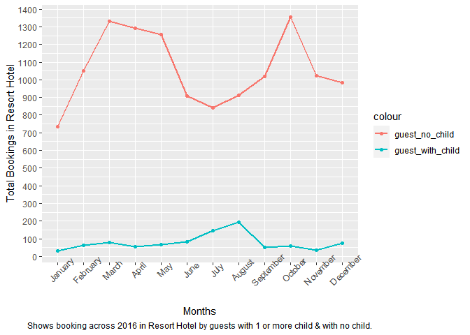<!-- -->

**Findings**

-   During year 2016, most bookings made by guests with no accompanying
    child in resort hotels peaked during mid February, slightly going
    down in march and going down heavily for arrivals in May. It peaked
    again in August till October.

-   During year 2016, most bookings made by guests with 1 or more
    accompanying child in resort hotels peaked during July- August.

-   When compared to bookings by guests with 1 or more accompanying
    child in a City hotel, the overall booking pattern indicates that
    guests with children didn’t prefer the resort hotel much.

### Booking agents/analysis

Which booking agency has highest number of bookings in both the hotels ?

``` r
# City Hotel

hotel_copy %>% 
  filter(is_canceled==0, hotel=="City Hotel") %>%
  select(hotel,agent) %>% 
  drop_na(agent) %>% 
  group_by(agent) %>% 
  summarise(total = n()) %>% 
  arrange(desc(total))
```

    ## # A tibble: 202 × 2
    ##    agent total
    ##    <fct> <int>
    ##  1 9     18693
    ##  2 7      3065
    ##  3 14     2988
    ##  4 1      1907
    ##  5 6      1717
    ##  6 28     1556
    ##  7 8       848
    ##  8 3       541
    ##  9 37      513
    ## 10 83      507
    ## # … with 192 more rows

**Findings**

Highest number of bookings across two years in the City Hotel was
facilitated by Travel Agency with ID 9

``` r
# Resort Hotel
hotel_copy %>% 
  filter(is_canceled==0, hotel=="Resort Hotel") %>% 
  select(hotel,agent) %>% 
  drop_na(agent) %>% 
  group_by(agent) %>% 
  summarise(total=n()) %>% 
  arrange(desc(total))
```

    ## # A tibble: 176 × 2
    ##    agent total
    ##    <fct> <int>
    ##  1 240    8422
    ##  2 250    2356
    ##  3 241    1485
    ##  4 40      920
    ##  5 314     764
    ##  6 6       548
    ##  7 242     519
    ##  8 243     486
    ##  9 298     330
    ## 10 171     314
    ## # … with 166 more rows

**Findings**

Highest number of bookings across two years in the Resort Hotel was
facilitated by Travel Agency with Agent ID 240.

### Cancellation Analysis

1.  How many bookings were cancelled out of total bookings ?

``` r
# plotting chart for bookings done during 2016 in City Hotel

plot_cancel_city <- hotel_copy %>%
  select(hotel, is_canceled, arrival_date_year) %>% 
  filter(hotel== "City Hotel", arrival_date_year== "2016") %>%
  group_by(is_canceled) %>% 
  count() %>%
  ungroup() %>% 
  mutate(perc = n/sum(n)) %>%
  arrange(perc) %>% 
  mutate(labels = scales::percent(perc)) %>% 
  ggplot(aes(x= "", y = perc , fill= is_canceled ))+
  geom_col()+
  geom_label(aes(label=labels), position= position_stack(vjust=0.5),
             show.legend = FALSE)+
  coord_polar(theta = "y")+
  theme_void()+
  labs(caption = "Pie Chart shows how much percentage of total bookings made for City Hotel got cancelled(0) & succesful(1)")+
  theme(plot.caption = element_text(hjust = 0.6, vjust = 5))

plot_cancel_city
```

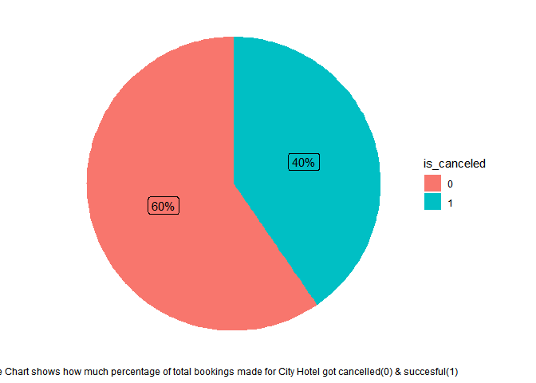<!-- -->

**Findings**

40% of the total bookings for arrival in the year 2016 got cancelled.
The reasons may be guest specific.

``` r
# calculating only for bookings done during 2016 in resort hotel

plot_cancel_resort <- hotel_copy %>%
  select(hotel, is_canceled, arrival_date_year) %>% 
  filter(hotel== "Resort Hotel", arrival_date_year== "2016") %>%
  group_by(is_canceled) %>% 
  count() %>%
  ungroup() %>% 
  mutate(perc = n/sum(n)) %>%
  arrange(perc) %>% 
  mutate(labels = scales::percent(perc)) %>% 
  ggplot(aes(x= "", y = perc , fill= is_canceled ))+
  geom_col()+
  geom_label(aes(label=labels), position= position_stack(vjust=0.5),
             show.legend = FALSE)+
  coord_polar(theta = "y")+
  theme_void()+
  labs(caption = "Pie Chart shows how much percentage of total bookings made for Resort got cancelled(0) & succesful(1)")+
  theme(plot.caption = element_text(hjust = 0.5, vjust = 5))

plot_cancel_resort
```

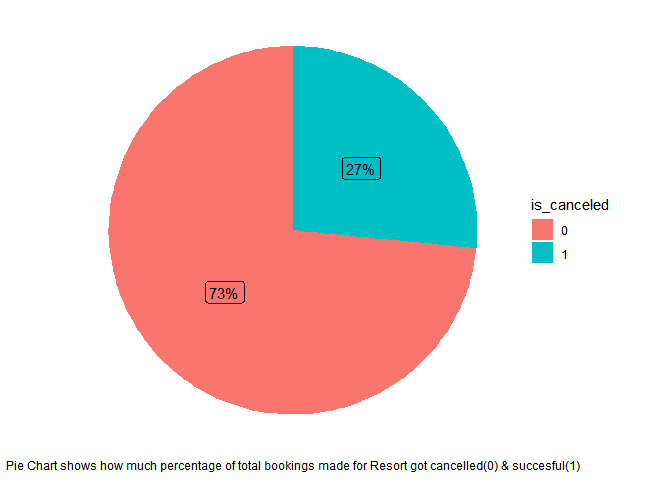<!-- -->

**Findings**

27% of the total bookings for arrivals in the year 2016 got cancelled.
This is lesser when compared to city hotels.

### ADR Analysis

1.  Which period of stay observed the maximum ADR ?

Average daily rates is a metric hotels use to determine their average
sales on a daily basis. It is calculated by summing up the prices of all
the rooms sold for a night divided by total number of rooms sold.

``` r
# Calculating total nights in separate column

hotel_copy <- hotel_copy %>% 
  mutate(total_nights = stays_in_weekend_nights+stays_in_week_nights)

hotel_copy <- hotel_copy %>% 
  rename(stays_total_nights = total_nights)
```

``` r
# Plotting to find optimal duration of booking in City Hotel

plot_adr_city  <- hotel_copy %>% 
  select(hotel, is_canceled, adr, stays_total_nights) %>% 
  filter(is_canceled==0,hotel=="City Hotel", !adr==0.00, stays_total_nights<=30) %>% 
  group_by(adr,stays_total_nights) %>% 
  summarise(total=n()) %>% 
  ggplot()+
  geom_col(aes(x= stays_total_nights, y= adr), width= 0.80)+
  scale_x_continuous(breaks=seq(0,30, by=2))+
  labs(x= "Total nights stays",y= "Average Daily Rate" , caption= "The plot shows total of Average Daily Rates corresponding to number of night stays by guests in a city hotel")+
  theme(plot.caption = element_text(hjust = 0.5))

plot_adr_city  
```

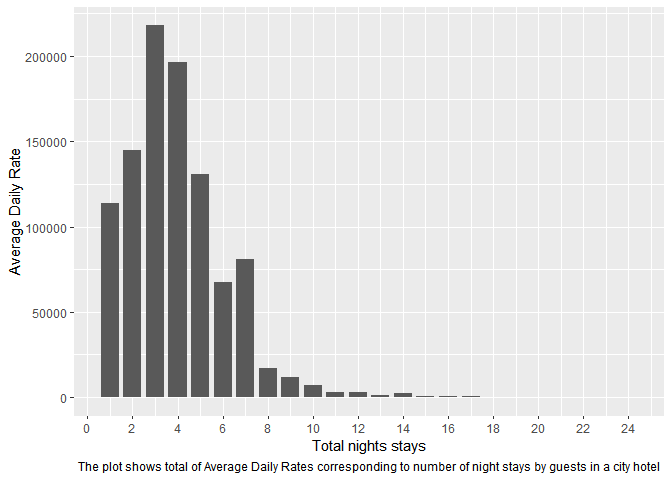<!-- -->

**Findings**

From this we can see that stays that were booked with 3 and 4 nights
achieved a good ADR in City hotels.

``` r
#Plotting to find optimal duration of booking in Resort Hotel

plot_adr_resort <- hotel_copy %>% 
  select(hotel, is_canceled, adr, stays_total_nights) %>% 
  filter(is_canceled==0,hotel=="Resort Hotel", !adr==0.00, stays_total_nights<=30) %>% 
  group_by(adr,stays_total_nights) %>% 
  summarise(total=n()) %>% 
  ggplot()+
  geom_col(aes(x= stays_total_nights, y= adr), width= 0.80)+
  scale_x_continuous(breaks=seq(0,30, by=2))+
  labs(x= "Total nights stays",y= "Average Daily Rate" , caption= "The plot shows total of Average Daily Rates corresponding to number of night stays by guests in a resort hotel")+
  theme(plot.caption = element_text(hjust = 0.5))

plot_adr_resort
```

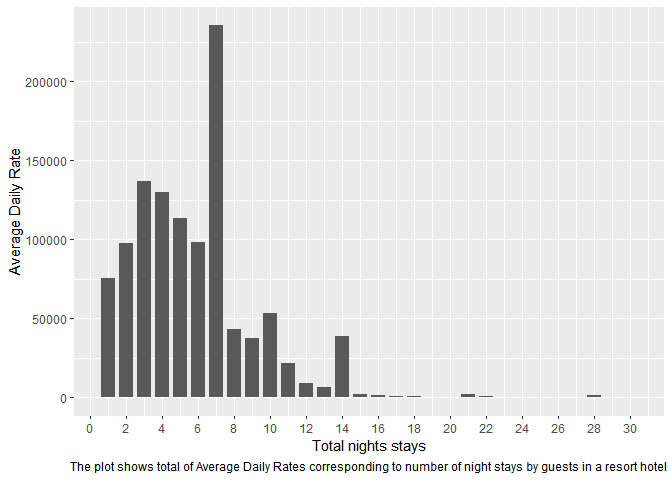<!-- -->

**Findings** From this we can see that stay that were booked with 7
nights achieved a good ADR in resort hotels.

### Meals Analysis

What are the different types of meals booked by bookings that did not
get cancelled ?

``` r
# City hotel
plot_meal_city <-  hotel_copy %>%
  select(hotel, meal, is_canceled, arrival_date_year) %>% 
  filter(is_canceled== 0, hotel=="City Hotel") %>%
  ggplot()+
    geom_bar(aes(x= meal), fill= 'skyblue')+
  facet_wrap(~arrival_date_year)+
  labs(x= "Meal types",y= "Total bookings" , caption= "Plot shows different Meal bookings by guests in a City Hotel")+
  theme(plot.caption = element_text(hjust = 0.5))

plot_meal_city  
```

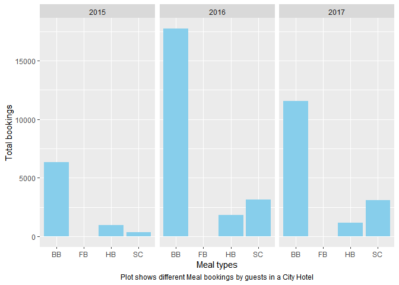<!-- -->

**Findings**

Most meals booked by guests in City Hotel during the two recorded
periods was Bed & Breakfast.

``` r
# resort hotel
plot_meal_resort <- hotel_copy %>%
  select(hotel, meal, is_canceled, arrival_date_year) %>% 
  filter(is_canceled== 0, hotel=="Resort Hotel") %>%
  ggplot()+
    geom_bar(aes(x= meal), fill= 'skyblue')+
  facet_wrap(~arrival_date_year)+
  labs(x= "Meal types",y= "Total bookings" , caption= "Plot shows different Meal bookings by guests in a Resort Hotel")+
  theme(plot.caption = element_text(hjust = 0.5))
plot_meal_resort
```

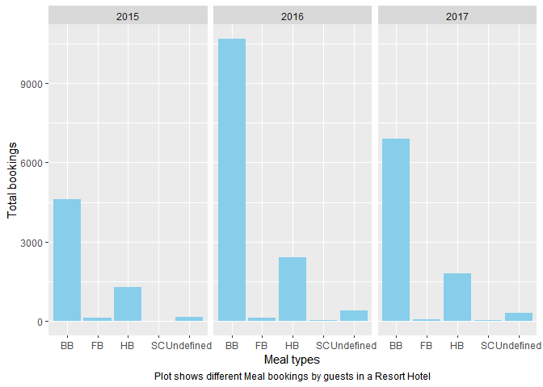<!-- -->

**Findings**

In resort hotels, Bed & breakfast seems the most preferred meal booked.

## Share

I have created a presentation on Slides to present the analysis in front
of the stakeholders. The presentation can be found
[Here](https://docs.google.com/presentation/d/1yX82ZGJ1xvpt742bmyfRwa_JMGkHEDM2yHzhgQWyCy8/edit?usp=sharing)

## Act

**High level recommendations based on findings**

-   Making packages & plans with 3/4 nights with some added benefits to
    attract customers.
-   Creation of packages & offers with 3/4 nights with some added
    benefits to attract customers if it’s a city hotel & 7 nights if
    it’s a resort hotel. These are optimal stays with high ADR
    potential.
-   Bookings in the city hotel seem to be higher than resort hotel so
    the marketing team can invest more in the city hotel business during
    ad campaigns.
-   Both City hotel & resort hotel had maximum bookings coming from
    Portugal. The hotel packages could be made keeping the domestic
    client’s requirements in the mind.
-   City Hotel also had maximum bookings from France & Germany. The
    hotel marketing team can target these regions to promote the hotel.
-   Online travel agencies played major role in bringing maximum
    business to the hotels. Tie ups with OTAs could be a beneficial in
    getting a wider market reach for selling rooms.
-   Since direct room selling has benefits of creating an organic reach
    as compared to travel agencies, the marketing team can use popular
    online tools like SEO, Social Media Ad campaigns, Influencer
    marketing to reach the potential customers.
-   Transient type bookings are maximum in both resort & city hotel.
    This finding can be used by engaging more with guests during hotel
    stay to make them aware of the hotel’s website for direct room
    bookings and also connecting them with social media channels by
    promoting during the stay. Social media channels play a good role in
    promoting special packages and events in order to attract customers.
-   April-May & August-September are good months to sell rooms at
    competitive prices for a city hotel. June-August seem to be best
    months to sell rooms with family package for city hotel.
-   February & August-October are good months to sell room at
    competitive prices for a resort hotel. In resort hotel, guests with
    accompanying child made maximum bookings during July-August. Ad
    campaigns can be run in these months to promote family package for
    resort hotels.
-   City Hotel saw most number of cancellations than resort hotel. No
    specific information was found regarding cancellation during the
    analysis but a further deep dive using predictive tools like Machine
    Learning can be implemented to find if the current variables played
    any role in it.
-   Breakfast Plan **Bread & Breakfast** sells more than any other meal
    plans so it can be promoted more during bookings done through
    reservation department. Also since half breakfast comes in second
    number as most preferred meal plan, it can be used as a plan when
    upselling rooms.

# Attributions

-   Kaggle dataset used in the project was sourced from [Hotel booking
    demand](https://www.kaggle.com/datasets/jessemostipak/hotel-booking-demand)

-   Science-direct hosts [Source
    document](https://www.sciencedirect.com/science/article/pii/S2352340918315191)

-   Photos by [Tholaal
    Mohamed](https://unsplash.com/@tholaal_mohamed?utm_source=unsplash&utm_medium=referral&utm_content=creditCopyText),
    [Hana
    Kim](https://unsplash.com/@hana_keem?utm_source=unsplash&utm_medium=referral&utm_content=creditCopyText),
    [Brecht
    Denil](https://unsplash.com/@brechtdenil?utm_source=unsplash&utm_medium=referral&utm_content=creditCopyText),
    [Huy
    Nguyen](https://unsplash.com/@huynguyen_pch?utm_source=unsplash&utm_medium=referral&utm_content=creditCopyText)
    on
    [Unsplash](https://unsplash.com/?utm_source=unsplash&utm_medium=referral&utm_content=creditCopyText),
